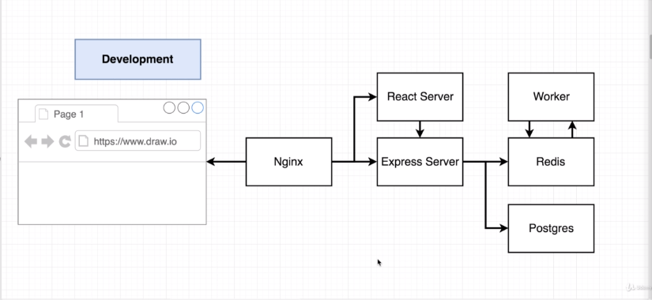
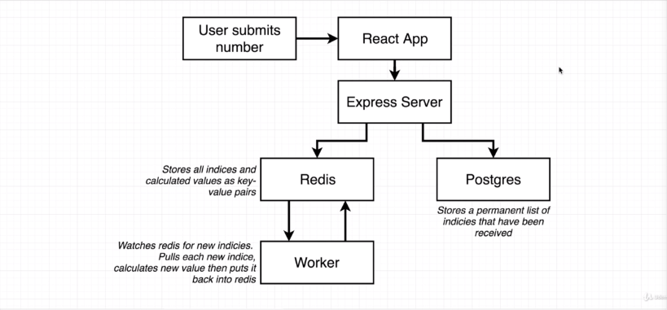

# Fibonacci calculator

This is a crazy over-the-top way overcomplicated version of a Fibonacci calculator.
Main objective is to get more experience with a multi container deployment.

#### Application Architecture

     Nginx               # to do some routing
     React Server        # get some front-end mockup | assets
     Express Server      # to set backend API
     Worker              # a separate backend NodeJS process
     Redis               # a memory data-store for housing temporary value
     Postgres            # a database

#### How it works all together

 

#### Available deployment configs

